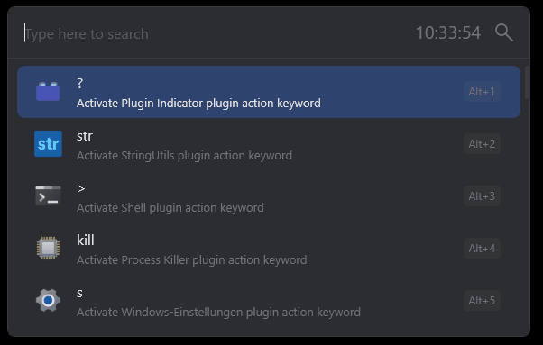

Flow.Launcher.Plugin.RemoteDesktop
==================

A plugin for the [Flow launcher](https://github.com/Flow-Launcher/Flow.Launcher) to start rdp connections.

## Installation

### Manually

1. Download the latest release from [here](https://github.com/XDFUN/Flow.Launcher.Plugin.RemoteDesktop/releases)
2. Extract the downloaded zip file
3. Copy the extracted folder to the Flow Launcher plugins directory (usually located at `%APPDATA%\FlowLauncher\Plugins\FlowLauncher`)

### Script

Each release contains a script to install the plugin in that specific release version.

1. Download the latest release script from [here](https://github.com/XDFUN/Flow.Launcher.Plugin.RemoteDesktop/releases)
2. Execute the downloaded script

## Usage

    rdp <ip or hostname>

## Third-Party

1. Icon [Remote Desktop](https://icons8.com/icon/lqN1-eJ3he4o/remote-desktop) provided by [Icons8](https://icons8.com)