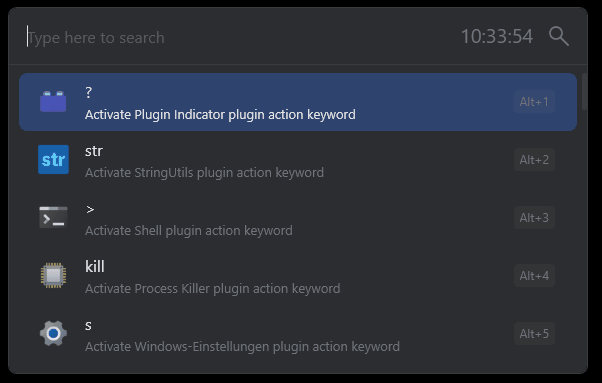

Flow.Launcher.Plugin.RemoteDesktop
==================

A plugin for the [Flow launcher](https://github.com/Flow-Launcher/Flow.Launcher) to start rdp connections.

## Installation

### Plugin Store

The plugin is available in the [Flow Launcher plugin store](https://www.flowlauncher.com/plugins/remote-desktop-518E2D95-D89E-44E6-8B99-3A71D977E93A/).

### Script

Each release contains a script to install the plugin in that specific release version.

1. Download the latest release script from [here](https://github.com/XDFUN/Flow.Launcher.Plugin.RemoteDesktop/releases)
2. Execute the downloaded script

### Manually

1. Download the latest release from [here](https://github.com/XDFUN/Flow.Launcher.Plugin.RemoteDesktop/releases)
2. Extract the downloaded zip file
3. Copy the extracted folder to the Flow Launcher plugins directory (usually located at `%APPDATA%\FlowLauncher\Plugins\FlowLauncher`)

## Usage

    rdp <ip or hostname>

## Features

### Recent Usage Bonus

Results are ranked based on recent usage, making frequently used connections easier to access.

### Default User

A default user can be configured for new connections. Different default users can also be assigned using regular expression rules.
The default user is only applied when creating a new connection.
The user for a connection is displayed in parentheses next to the IP address or hostname.

### Aliases

Aliases can be defined for IP addresses or hostnames. They inherit the recent usage bonus and default user settings from the underlying IP address or hostname.

## Third-Party

1. Icon [Remote Desktop](https://icons8.com/icon/lqN1-eJ3he4o/remote-desktop) provided by [Icons8](https://icons8.com)